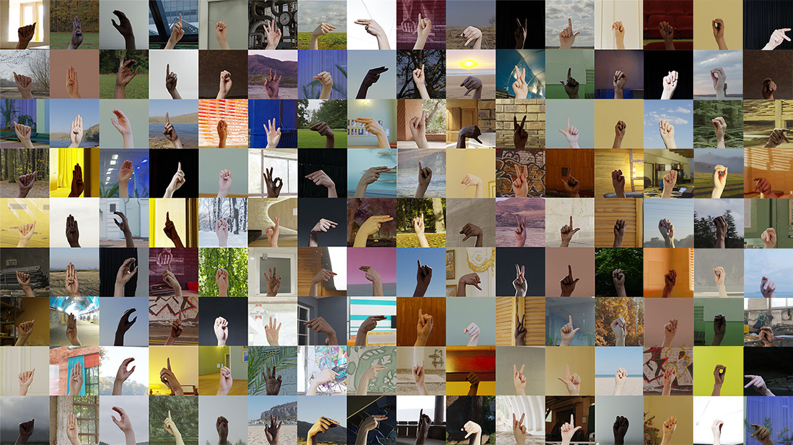

# ASL-OpenCV

## ASL Alphabet Recognizer with Deep Learning Neural Network

This project is an implementation of a deep learning neural network for recognizing the American Sign Language (ASL) alphabet using computer vision techniques. The model is trained to recognize hand gestures corresponding to each letter of the ASL alphabet.

## Dataset

The dataset used in this project is the "Synthetic ASL Alphabet" dataset, which can be found on Kaggle at [this link](https://www.kaggle.com/datasets/lexset/synthetic-asl-alphabet). This dataset is a valuable resource for training and testing ASL alphabet recognition models. Here are some key details about the dataset:

- **Source**: The dataset was created by LexSet and made available on Kaggle. It is a synthetic dataset, meaning that the images are generated synthetically rather than being captured from real-life scenarios.

- **Contents**: The dataset contains a diverse set of hand gesture images representing the 26 letters of the ASL alphabet, from 'A' to 'Z'. Each letter is associated with multiple images showcasing different hand poses and variations. The images are labeled with their corresponding alphabet letters.

- **Usage**: In this project, we use the "Synthetic ASL Alphabet" dataset for training our deep learning neural network. The dataset provides a sufficient variety of hand gestures to train a robust model for ASL alphabet recognition.


<em>ASL Alphabet, by @LexSet</em>

## Requirements

- Python (>=3.6)
- OpenCV (>=4.0)
- PyTorch (>=1.7)
- NumPy (>=1.19)

## Usage

1. Clone the repository:
   ```bash
     git clone https://github.com/yourusername/ASL-OpenCV.git
     cd ASL-OpenCV
   ```
2. Install the required dependencies:
   ```bash
    pip install opencv-python mediapipe torch torchvision torchviz numpy pandas scikit-learn 
   ```
3. Run the test notebook

## Tools used
Hand Landmarks: The project uses the MediaPipe library to extract hand landmarks from each image in the dataset. Hand landmarks are specific points or coordinates on the hand that represent key features, such as finger joints and palm locations.

## Data Architecture
- **Data Representation**: For each image in the dataset, the extracted hand landmarks are used to create a feature vector. The feature vector represents the spatial coordinates of these landmarks. Each landmark's (x, y, z) coordinates become individual elements in the feature vector.
- **Data Organization**: The feature vectors from all images are organized into a database-like structure, where each row corresponds to a sample image, and each column represents the coordinates of a specific hand landmark. This structured dataset is used for training and testing the deep learning model.

## Image Example

- For a more detailed usage Example, see the test notebook


